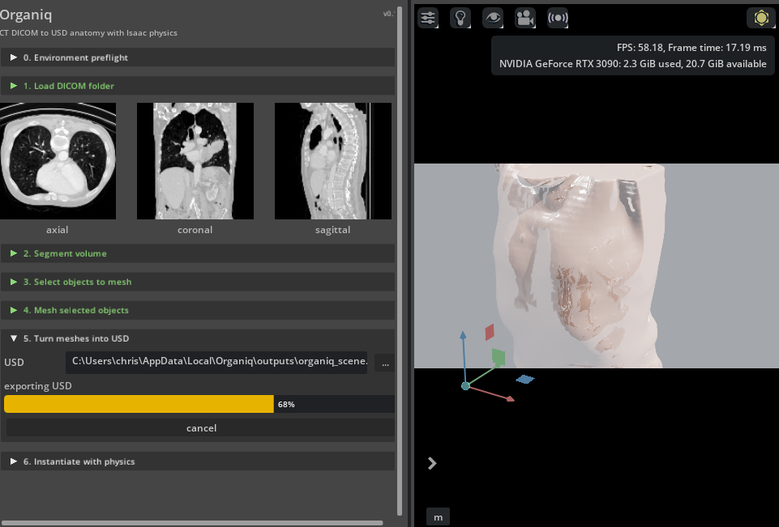

# Organiq

Sim Ready anatomy from DICOM volumes.

Organiq turns DICOM volume data into organised anatomy assets for Isaac Sim. It gives simulation teams anatomical geometry with reusable USD structure, tissue-aware materials and physics metadata.

The extension workflow is:

1. Load a DICOM folder and select a CT series.
2. Segment the volume using a MONAI bundle and add a CT-derived outer skin shell.
3. Select labels to mesh from grouped anatomy trees, with global and group-level selection controls.
4. Build organic meshes from signed distance fields generated from the selected label masks and carry per-label mean Hounsfield values into the mesh records.
5. Export a USD scene with an instanceable anatomy component.
6. Instantiate the component in Isaac with tissue-specific textured visual materials and physics.

The supported MONAI bundle is `wholeBody_ct_segmentation`. It is the only default segment panel choice because it resolves with `configs/inference.json`, `models/model_lowres.pt`, `models/model.pt` and TotalSegmentator-style label metadata. Downloads, model caches and USD exports use a per-user Organiq cache directory by default. Set `ORGANIQ_WORK_ROOT` to move those files to a project, shared or scratch volume.

Organiq stages MONAI input volumes as a bundle-style `dataset_dir\imagesTs` folder and writes the whole-body bundle `displayable_configs#highres` override explicitly. The default UI path starts with the low-resolution checkpoint and retries the high-resolution checkpoint if the bundle returns only background.

If a manually supplied bundle name is not supported, or a cached bundle is missing the expected inference config, Organiq stops before inference and reports the unsupported name or missing file path.

## Workflow demo




[Watch the MP4 version](docs/assets/organiq-workflow-demo.mp4)

## Launch

From PowerShell:

```powershell
$env:ISAACSIM_ROOT = "C:\path\to\isaacsim"
tools\launch_organiq.ps1
```

The launcher enables `com.chrisvoncsefalvay.organiq` from this repository and also enables the timeline and PhysX extensions Organiq needs. It can discover Isaac Sim from `ISAACSIM_ROOT`, `ISAAC_SIM_ROOT`, `OMNI_USER_PACKAGE_ROOT` or the Omniverse package cache. You can also pass explicit paths:

```powershell
tools\launch_organiq.ps1 -Kit "C:\path\to\isaacsim\kit\kit.exe" -Experience "C:\path\to\isaacsim\apps\isaacsim.exp.full.kit"
```

## Dependencies

Organiq keeps heavy medical imaging packages optional so the extension can load before the workstation environment is fully prepared.

Recommended Isaac Python packages:

```powershell
& "$env:ISAACSIM_ROOT\python.bat" -m pip install --prefer-binary --constraint .\constraints\isaac-5.1.txt ".[isaac]"
```

The extension preflight panel reports which packages are present and can install missing packages into the active Isaac Python environment using the same constraints file.

Set `ORGANIQ_MONAI_TIMEOUT_SECONDS` to override the default four-hour MONAI inference timeout. Active UI jobs can be cancelled from the progress panel. Subprocess output is bounded in memory and long-running MONAI status includes elapsed time and host memory telemetry when `psutil` is present.

The mesher derives a signed distance field for each selected label, extracts the zero level set with Flying Edges when VTK is present or marching cubes otherwise, removes degenerate triangles, applies displacement-limited Taubin smoothing, optionally decimates very large soft-tissue meshes and authors vertex normals. It falls back to explicit voxel faces for small masks when the smooth meshing stack has not been installed. USD mesh prims carry `organiq:meanHounsfield` for downstream reconstruction and simulation tuning. Exported USDs keep materials and physics materials inside the anatomy component, use portable relative texture paths and instantiate that component as an instanceable reference.

## Validation

Run the pure Python checks from the repo root:

```powershell
python -m pytest
python tools\check_extension.py
python tools\package_extension.py --clean
python tools\check_distribution.py --require-archives
```

Run USD export checks inside a Kit process where `pxr` is loaded:

```powershell
python tools\check_usd_export.py
```

Run the Isaac viewport runtime check from the repo root:

```powershell
& "$env:ISAACSIM_ROOT\kit\kit.exe" "$env:ISAACSIM_ROOT\apps\isaacsim.exp.full.kit" --ext-folder (Resolve-Path .\source\extensions) --enable omni.timeline --enable omni.physx.bundle --enable com.chrisvoncsefalvay.organiq --exec (Resolve-Path .\tools\check_kit_runtime.py)
```

Run the full DICOM plus MONAI plus viewport workflow check from the repo root:

```powershell
& "$env:ISAACSIM_ROOT\kit\kit.exe" "$env:ISAACSIM_ROOT\apps\isaacsim.exp.full.kit" --ext-folder (Resolve-Path .\source\extensions) --enable omni.timeline --enable omni.physx.bundle --enable com.chrisvoncsefalvay.organiq --exec (Resolve-Path .\tools\check_dicom_workflow.py)
```

Run the window startup check in the same Kit process shape when you need UI launch evidence:

```powershell
& "$env:ISAACSIM_ROOT\kit\kit.exe" "$env:ISAACSIM_ROOT\apps\isaacsim.exp.full.kit" --ext-folder (Resolve-Path .\source\extensions) --enable omni.timeline --enable omni.physx.bundle --enable com.chrisvoncsefalvay.organiq --exec (Resolve-Path .\tools\check_organiq_window.py)
```

Run the acceptance check after the USD, Kit runtime and DICOM workflow checks have produced reports:

```powershell
python tools\check_acceptance.py
```

## Distribution

Organiq is prepared for NVIDIA Omniverse community registry distribution from `https://github.com/chrisvoncsefalvay/organiq`. The repository must be public, tagged with the GitHub topic `omniverse-kit-extension` and released with a Kit-importable archive generated by:

```powershell
python tools\package_extension.py --clean
```

The archive name must be a valid Kit extension package id, because Extension Manager imports the zip into a folder named after the archive:

```text
com.chrisvoncsefalvay.organiq-0.1.0.zip
```

Run `python tools\check_distribution.py --require-archives` before tagging a release.

If Extension Manager has a stale local import from an older archive name, close Isaac and run `.\tools\repair_isaac_extension_import.ps1`.

## References

- `docs\physics_defaults.md` records the tissue density, material and PhysX defaults.
- `docs\omniverse_practices.md` records the Omniverse material, scene, physics and extension practices used by the code.
- `docs\distribution.md` records the Omniverse community registry release process, archive name and GitHub topic requirements.

## Author

I'm [Chris von Csefalvay](https://chrisvoncsefalvay.com), an AI researcher specialising in post-training, and the author of _[Post-Training: A Practical Guide for AI Engineers and Developers](https://posttraining.guide)_ (No Starch Press, 2026). I also write [Post-Slop](https://postslop.substack.com), a periodic diatribe about AI and what it is doing to society. You can also find me on [LinkedIn](https://linkedin.com/in/chrisvoncsefalvay) and [X](https://x.com/epichrisis).

## Licence

MIT. See [LICENSE](LICENSE) in the repository.
